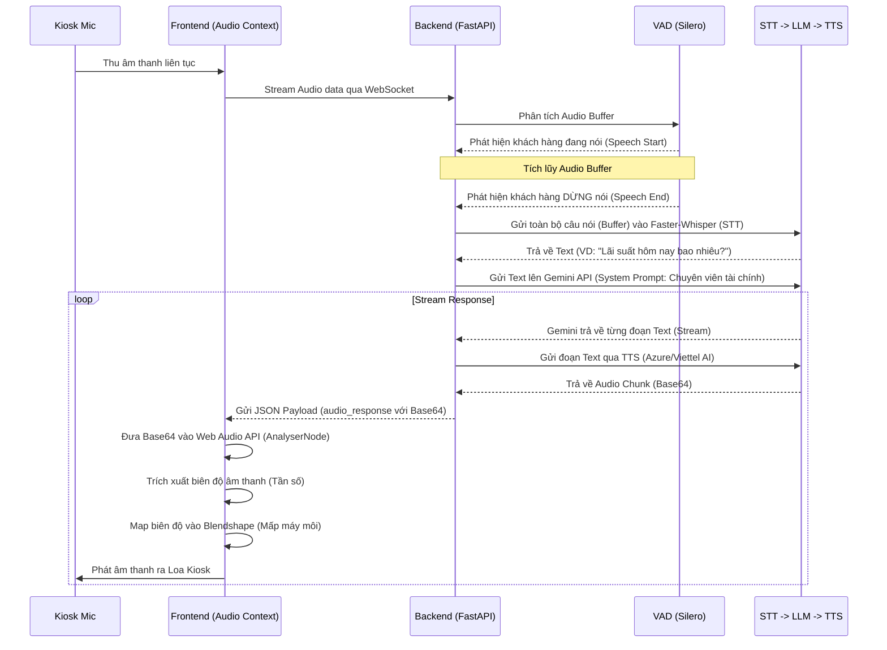

```mermaid
sequenceDiagram
    participant Mic as Kiosk Mic
    participant Front as Frontend (Audio Context)
    participant WS as Backend (FastAPI)
    participant VAD as VAD (Silero)
    participant AI as STT -> LLM -> TTS

    Mic->>Front: Thu âm thanh liên tục
    Front->>WS: Stream Audio data qua WebSocket
    WS->>VAD: Phân tích Audio Buffer
    
    VAD-->>WS: Phát hiện khách hàng đang nói (Speech Start)
    Note over WS, VAD: Tích lũy Audio Buffer
    
    VAD-->>WS: Phát hiện khách hàng DỪNG nói (Speech End)
    
    WS->>AI: Gửi toàn bộ câu nói (Buffer) vào Faster-Whisper (STT)
    AI-->>WS: Trả về Text (VD: "Lãi suất hôm nay bao nhiêu?")
    
    WS->>AI: Gửi Text lên Gemini API (System Prompt: Chuyên viên tài chính)
    
    loop Stream Response
        AI-->>WS: Gemini trả về từng đoạn Text (Stream)
        WS->>AI: Gửi đoạn Text qua TTS (Azure/Viettel AI)
        AI-->>WS: Trả về Audio Chunk (Base64)
        
        WS-->>Front: Gửi JSON Payload (audio_response với Base64)
        
        Front->>Front: Đưa Base64 vào Web Audio API (AnalyserNode)
        Front->>Front: Trích xuất biên độ âm thanh (Tần số)
        Front->>Front: Map biên độ vào Blendshape (Mấp máy môi)
        Front->>Mic: Phát âm thanh ra Loa Kiosk
    end
```